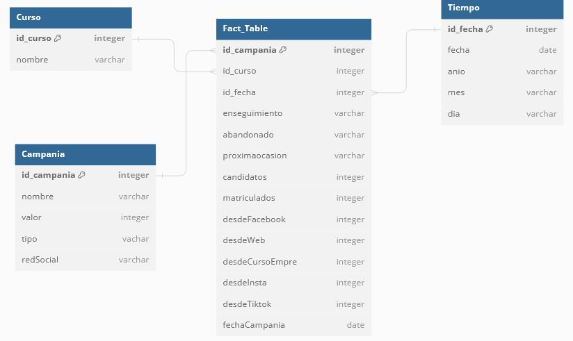

# datawarehouse-MT

<h1><a href="https://sourceforge.net/projects/pentaho/" target="blank" rel="noopener noreferrer"># <i>Pentaho PDI<i></a></h1>

In this data warehouse, we have collected and built a database which is called a data warehouse, this allows to know in a post-data analysis, about yearly sales performance in two businesses: an Education Tech Company and a Higher Education Institute.
The mechanism used was the ETL process, which is extraction, transformation of the data, and loading toward the final Data Warehouse. It was necessary to make a map about how the data would be extracted from the main database of the businesses. Finally, was also necessary the transformations that the raw data would need previously to charge to the data warehouse.

A data warehouse consists of designing its tables in the next way: The **dimensional** and **fact tables**. The dimensional tables are tasked to feed the main table called the fact table, it also contains important information to get analyzed but it is related to each dimension table using the primary key to get other information that can be also considered in a post-analysis of the data warehouse.

We can see three-dimensional tables and fact tables. This information gives us about the sales performances that the sales team has done over the year.

<h3>ETL process about courses</h3>
 
  
  
<h3>ETL process about tiempo</h3>
 
  
  
<h3>ETL process about campaigns</h3>
 
  
  
<h3>ETL process about the tracking of the sales</h3>
 
  

The result of the ETL process in dimension tables and fact tables is to build the final data warehouse which is very useful at the time to develop visualizations of key metrics in dashboards like Power BI, Tableau, etc.

 
     
